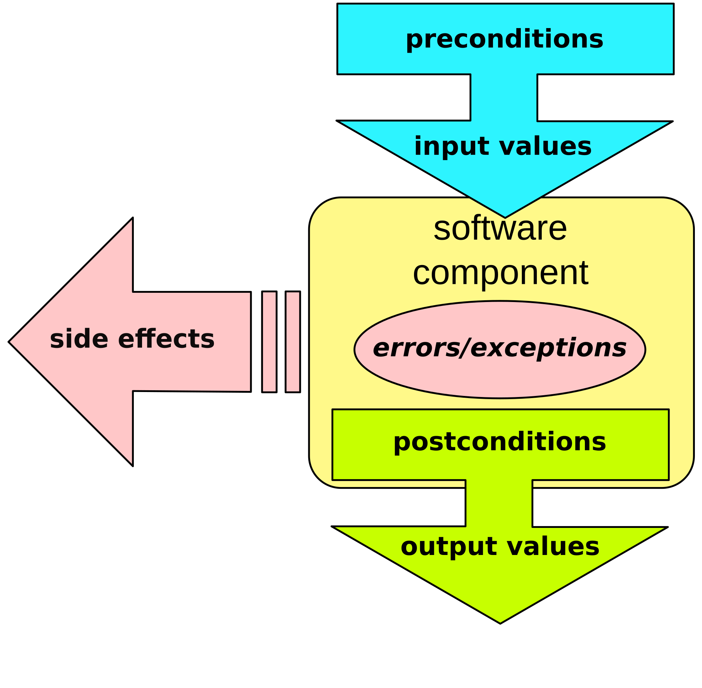
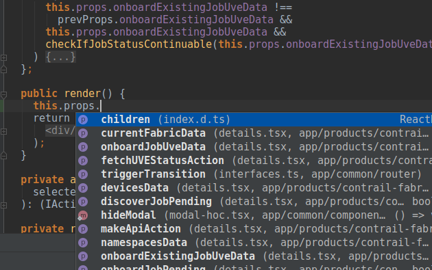

import { Head, Code, Appear, components as Components } from 'mdx-deck'
import { FullscreenCode, Split, SplitRight } from 'mdx-deck/layouts'
import TypescriptCode from './components/typescript-code'

export { default as theme } from './theme'

# Witamy na froncie


---
<Head>
  <title>Typescript - basics, and a step ahead</title>
</Head>

# Typescript

Prepared by Bartosz Lewiński

Workshop repo: https://github.com/Blewin/typescript-workshop-exercises


---

## What will we learn
0. What typescript is about
1. Basic Typescripts
2. Slightly advanced typescript tips and tricks
  - algebraic data types
  - generics

---

## Why

Contracts

---
## simpler:
Like a contract:
- we have a client (API user) who wants something from contractor (a module)
- client has to supply materials (input)
- contractor has to deliver finished product (output) that satisfied specification

---

```
interface Person {
    firstName: string;
    lastName: string;
}

function greeter(person: Person):String {
    return "Hello, " + person.firstName + " " + person.lastName;
}

let user = { firstName: "Jane", lastName: "User" };
console.log(greeter(user));
```

---

---

## How? Exercise 0
```
git clone git@github.com:Blewin/typescript-workshop-exercises.git
npm install
npm run compile
#Check out the `dist` directory
node build/src/hello.js #to run
```

---

## Basic types

 - Boolean
 - Number
 - String

`let isDone: boolean = false`
 - Arrays

`const bestNumbers: number[] = [1,2,4];`
---
## Functions
```
type functionType = (argument: number) => string;
const function = (argument: number): number => {
  return argument+2;
}
```
## Special basic types
 - void - return type of a function that returns nothing
 - never - value that should not occur
   `() => throw Error('Error World')§)
---

## Exercise nr 1
Exercise workflow:
 - rename exercise1.ts.todo to exercise1.ts
 - fix errors until `npm run compile` passes
```
type helloPrinterType = never;
const helloPrinter: helloPrinterType = (world) => console.log(`Hello ${world}`)

type arrayMapperType = never;
const arrayMapper: arrayMapperType = (array, fun) => array.map(fun);
```
---
 - Javascript Objects
```
interface Box {
    height: number;
    width: number;
}

type Arrow = {
    color: string;
    target: string:
}
```
---

## Exercise nr 2
```
interface Person {
    firstName: string;
    lastName: string;
}

class Zbigniew implements Person {
//tutaj zmiany
}

class Franek extends Zbigniew {
    //co tutaj potrzebne
}

console.log(new Zbigniew().firstName, new Franek().lastName);

```
---
# types vs interfaces

 - implements / extends (Interfaces are guaranteed extendable/implementable)
 - interface merging

---
```
interface Box {
    height: number;
    width: number;
}

interface Box {
    scale: number;
}

let box: Box = {height: 5, width: 6, scale: 10};
```

---
# intersection - "AND"
```
type MyProps = StateProps & OwnProps;

type credentials = {name: string} & {password: string}

```
---
# union - "OR"

```
type result = {
  status: 'error' | 'success';
  msg: string;
}

type result2 = {
  status: 'error';
  errorNumber: number;
} | {
  status: 'ok';
  data: number[];
}

```
---
# Typeguardy
```
let pet = getSmallPet();

// Each of these property accesses will cause an error
if (pet.swim) {
    pet.swim();
}
else if (pet.fly) {
    pet.fly();
}
```
---
```
function isFish(pet: Fish | Bird): pet is Fish {
    return (<Fish>pet).swim !== undefined;
}

if (isFish(pet)) {
    pet.swim();
}
else {
    pet.fly();
}
```

---
# Exercise 3
```
interface Square {
    kind: "square";
    size: number;
}
interface Rectangle {
    kind: "rectangle";
    width: number;
    height: number;
}
interface Circle {
    kind: "circle";
    radius: number;
}
```
---

# Exercise 4
```
type UserList = UserData[];
type UserData = {
  name: string,
  favouriteIceCream: string,
} | (
 OfficialRecord & IceCreamData
)
type OfficialRecord = {firstname: string; lastname: string};
type IceCreamData = {bestIceCream: string};

const favouriteIceCreams = (userDataArray: UserList): string[] => {
 //?
}
```

---

## Special basic types

 - `any` - "turn off type checking"
```
let x: any = getDataFromAPI();
x.data[3].run() // passes
```
 - `unknown` - watch me like a hawk when using it
```
let y: unknown = getDataFromAPI();
if (typeof y === 'number'){
  console.log(`I ate ${y} apples`)
}
```

---
## Generic Types

```
 const identity = (x) => {return x };

 const s: string = identity(2); //NO ERROR
```
---
## generyki

Lodash: Identity
```
 const identity = <T>(x): T => {return x };

 const s: string = identity(2); //ERROR
```
---
## Exercise 5
```
const sum = (a, b) => a + b;

console.log(applyTwo(1, 2, sum);
console.log(applyTwo(3, 5, sum);
console.log(applyTwo('a', 'b', (a, b) => b + a + b + a);
```
---


React - HOC

 - remember about contracts - type
 - https://medium.com/@jrwebdev/react-higher-order-component-patterns-in-typescript-42278f7590fb

---
# Sources & links:

https://medium.com/@martin_hotell/interface-vs-type-alias-in-typescript-2-7-2a8f1777af4c

---

## Questions

---

Thank you for your participation.
